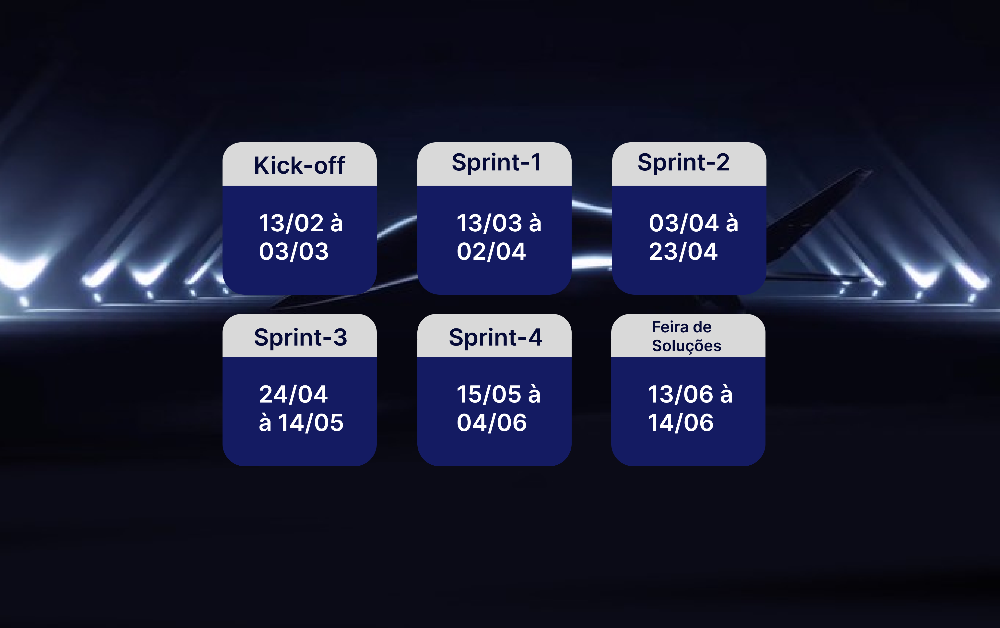
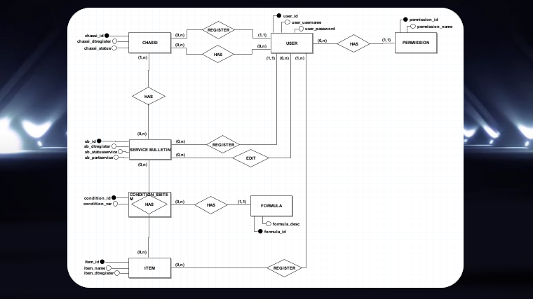
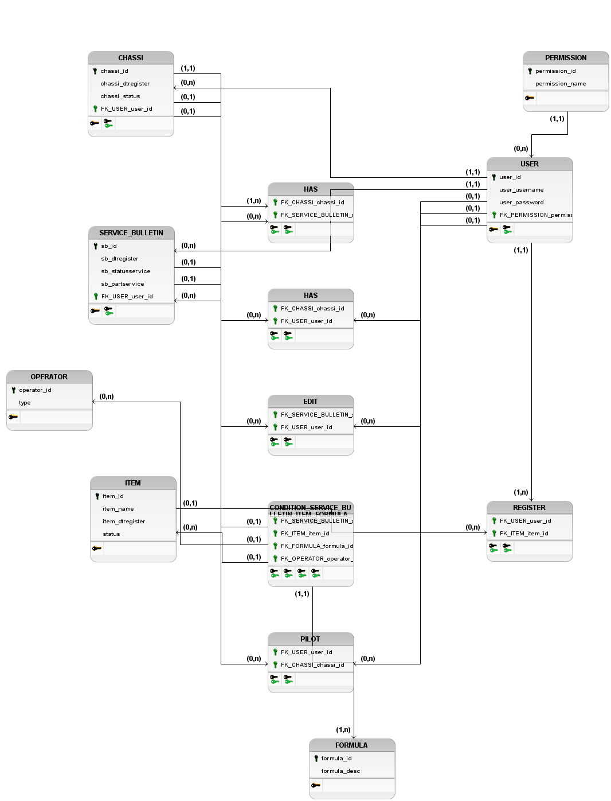

      

 
 
 
 
 

  <a href="#About-the-project">About the project</a> •
  <a href="#Schedule">Schedule</a> •
  <a href="#burndown">Burndown</a> •
  <a href="#Team">Team</a> •

  <a href="#Data Dictionary">Data Dictionary</a> •
  <a href="#Technologies Used">Technologies Used</a>

## Challenge
Currently, many pilots work as “freelancers” and do not operate just one aircraft/fleet, which makes it difficult to recognize certain equipment and software versions installed on the aircraft. Furthermore, the pilot does not always have quick access to all aircraft manuals and documents, which impairs his knowledge of the aircraft and its capabilities.

(<a href="#top">Back to top</a>)

Functional Requirements

      

• Access to the customer database (user, password and equipment);
      

• Users must have different profiles (administrator, editing and query);

• Board of Administration and Statistics;

• PDF generation and export.

      

     

Non-Functional Requirements

• Java Language
      

• Relational Database (Cloud)

• VUE
      

• Web System
      

• Documentation
      

(<a href="#top">Back to top</a>)

## Solution

Our team will develop a web software for the company "Embraer" that allows the easy import, manipulation and processing of data, visualization of data for its customers and administrators and the persistence of data in the database in a simplified way. In addition, it will be possible to filter this data by chassis, service bulletins and applicability of the improvement. However, Fluffy will also deliver three levels of access: Pilot, Client and Administrator, along with an administrative panel allowing the visualization of data in dashboards and modifications of users.

(<a href="#top">Back to top</a>)

## Schedule

 

(<a href="#top">Back to top</a>)

##  Sprint Goals

All items are organized from 0 to 2 according to the needs of each sprint.

Items that are not finalized will be reworked in other sprints.

<b>Sprint 1</b>

                  

                  
0

                        
•Data automation.
                  

                  

                  
1
                  
                        
•Search by Sb's.
                        
•Search by Items.
                        
•Search by Chassis.
                  

                   

                  
2
                  
                        
•Item Search by Chassis.
                        
•Search of Sb's by Chassis.                      
                  

 
   
 
 
              

<b>Sprint 2</b>

                  

                  
0

                        
•User Authentication and Authorization.
                  

                  

                  
1
                  
                        
•Access levels.                    
                  

                   

                  
2
                  
                        
•Registration of New Items.
                  

             

 
              

<b>Sprint 3</b>

                  

                  
0

                        
•Generate aircraft reports.
                  

                  

                  
1
                  
                        
•Edition of the Planes.
                        
•Edition of Sb's.      
                  

                   

                  
2
                  
                        
•Notifications of edits (via email).
                  

             

 
              

<b>Sprint 4</b>

                  

                  
0

                        
•Administrative panel.
                  

                  

                  
1
                  
                        
•Log Generation.                    
                  

                 
             

(<a href="#top">Back to top</a>)

## Mockup

WEB

      

Mobile

      

(<a href="#top">Back to top</a>)

## ERD

      

(<a href="#top">Back to top</a>)

## Logical Model

      

(<a href="#top">Back to top</a>)

## Data dictionary

[Click here to access the data dictionary](https://github.com/fluffyfatec/Projeto-Integrador-Embraer/blob/GIT_MODIFICATION/GIT/datadic.pdf)

(<a href="#top">Back to top</a>)

## Burndown

      

(<a href="#top">Back to top</a>)

## Team

| Avatar            							| Student         | Function          		| GitHub                                                      | LinkedIn                                              |
| -------------------------------------------- | ---------------- | ---------------- | -------------------------------------------------------------- | ----------------------------------------------------- |
| |_Patrick Souza_  | Scrum Master |   |  |
| |_Felipe Sobral_  | Product Owner  | |  |

(<a href="#top">Back to top</a>)

## Technologies Used

Front-End

* [JavaScript](https://www.javascript.com)
* [HTML](https://www.w3schools.com/css/)
* [CSS](https://www.w3schools.com/css/)
* [VUE](https://vuejs.org/)

Back-End

* [Java](https://www.java.com/pt-BR/?msclkid=7faa842eb8f811ecab39772d4c1ae90b)

* [Spring boot](https://spring.io/projects/spring-boot)

Database

* [Oracle Autonomous Database](https://www.oracle.com/br/autonomous-database/)

Meetings and Communication

* [Discord](https://discord.com/?msclkid=b4f5af84b8f811ecbd81c127a0ae68a7)

* [Whatsapp](https://www.whatsapp.com/)

* [Slack](https://slack.com/intl/pt-br/?msclkid=c00e628eb8f811ecaef374bb86d7f056)

Other Tools

* [Github](https://github.com/)

* [Eclipse IDE](https://www.eclipse.org/downloads/)

* [IntelliJ IDE](https://www.jetbrains.com/idea/promo/?msclkid=6ae44e88c2811d86c0ae2cdbd94ffcfb&utm_source=bing&utm_medium=cpc&utm_campaign=AMER_en_BR_IDEA_Branded&utm_term=intellij&utm_content=intellij%20idea)

* [Jira](https://apifluffy.atlassian.net/jira/software/projects/EA/boards/1)

* [Photoshop](https://www.adobe.com/br/products/photoshop.html?sdid=KQPOM&mv=search&ef_id=d67181c6b224183a4875e395ae54f4bf:G:s&s_kwcid=AL!3085!10!79302406606568!79302288716688&msclkid=d67181c6b224183a4875e395ae54f4bf)

(<a href="#top">Back to top</a>)

      

---

> GitHub [@fluffyfatec](https://github.com/fluffyfatec) &nbsp;&middot;&nbsp;
